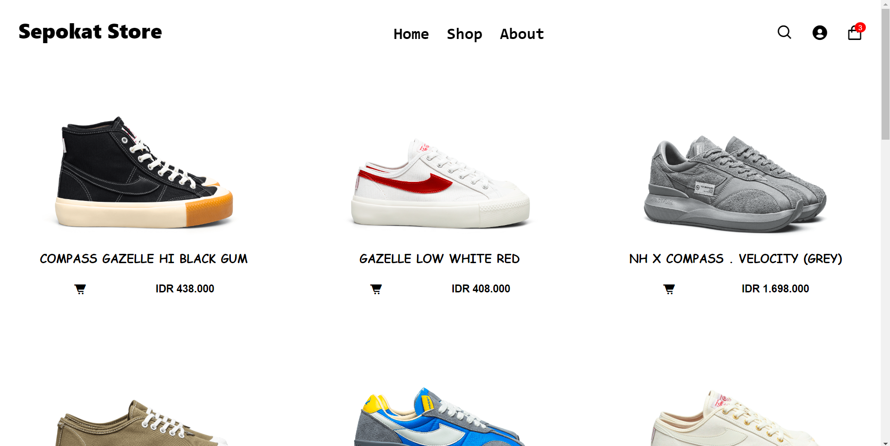
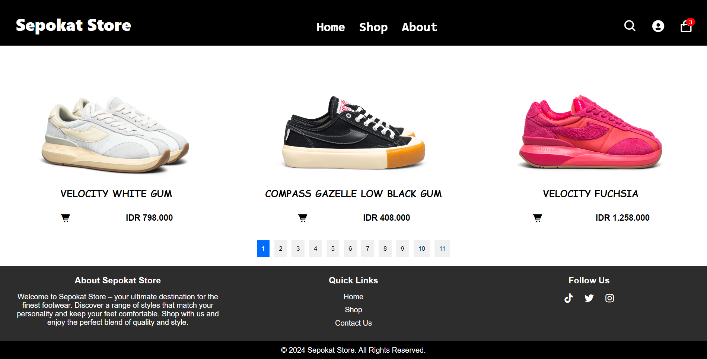
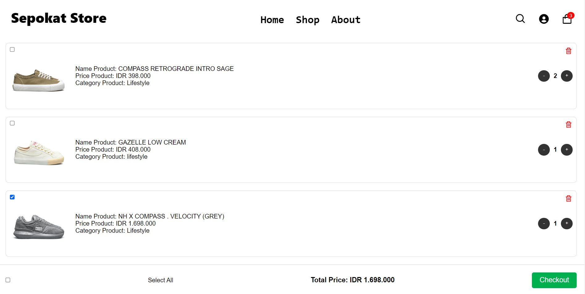
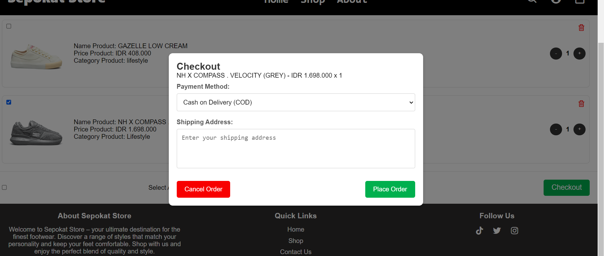
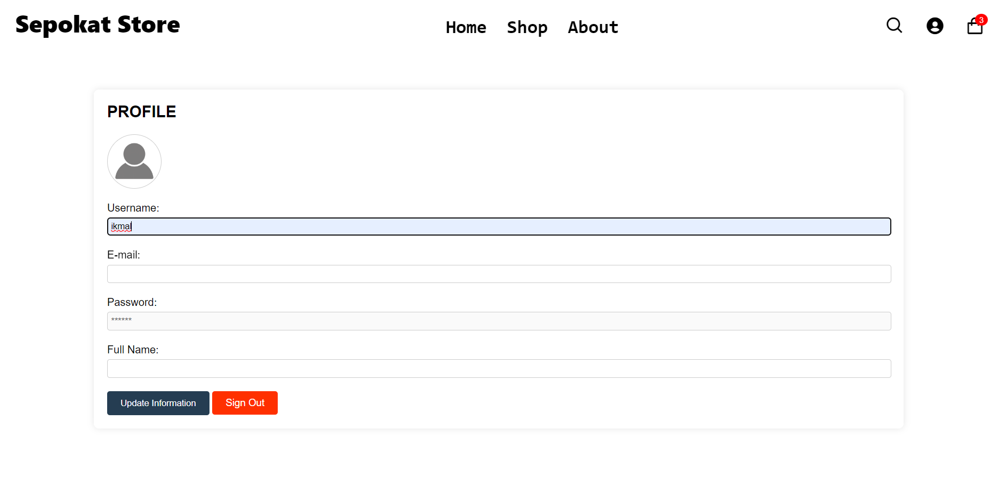
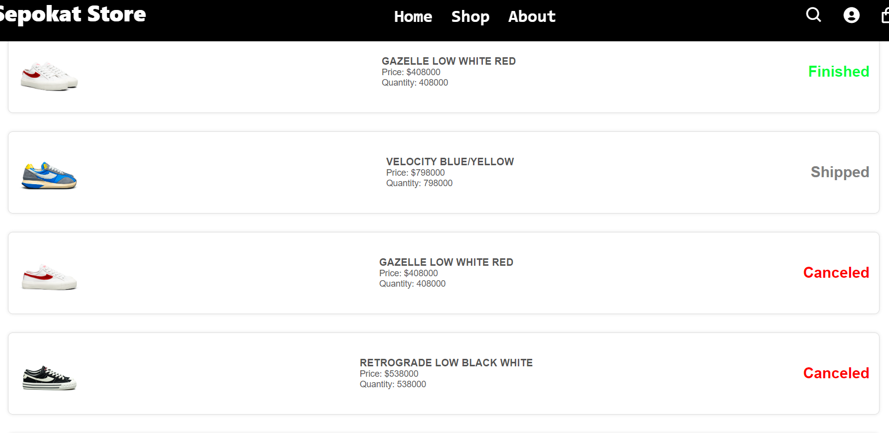
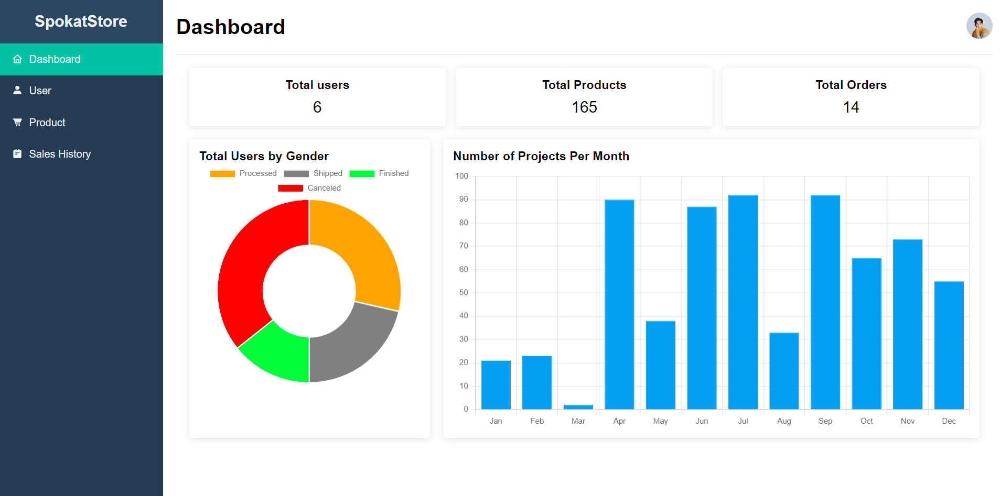

# Sepokat Store

Sepokat Store merupakan toko sepatu online yang dirancang untuk menawarkan pengalaman berbelanja yang elegan dan interaktif. Situs web ini dibangun menggunakan HTML, CSS, dan JavaScript untuk menyediakan antarmuka yang responsif dan ramah pengguna.

## Features

- **Homepage**: Menampilkan produk unggulan dan promosi.
- **Product Page**: Informasi produk terperinci dan opsi untuk menambahkan item ke keranjang.
- **Cart Page**: Lihat produk yang dipilih, sesuaikan jumlah, dan lanjutkan ke pembayaran.
- **Checkout Page**: Kelola alamat pengiriman dan opsi pembayaran.
- **Profile Page**: Perbarui informasi profil, lihat riwayat pembelian, dan keluar.
- **Admin Dashboard**: Lihat statistik, kelola produk, dan periksa status pesanan.

## Technologies Used

- **HTML**: For structuring the content.
- **CSS**: For styling the website and making it visually appealing.
- **JavaScript**: For interactive features and dynamic content.

## Pages

### 1. Homepage


Beranda menampilkan produk unggulan dan berbagai promosi. Pengguna dapat menavigasi ke berbagai bagian dan melihat penawaran terbaru.

### 2. Product Page




Halaman produk memberikan informasi detail tentang setiap produk, termasuk gambar, deskripsi, dan harga. Pengguna dapat menambahkan produk ke keranjang mereka dari halaman ini.

### 3. Cart Page



Di halaman keranjang, pengguna dapat meninjau produk pilihan mereka, menyesuaikan jumlah, dan melanjutkan ke pembayaran.

### 4. Checkout Page



Halaman checkout memungkinkan pengguna memasukkan alamat pengiriman, memilih metode pembayaran, dan menyelesaikan pesanan mereka.

### 5. Profile Page




Halaman profil memungkinkan pengguna memperbarui informasi pribadi mereka, melihat riwayat pembelian, dan keluar.

### 6. Admin Dashboard



Dasbor admin memberikan gambaran total pengguna, produk, dan pesanan. Ini juga mencakup grafik dan statistik untuk pengelolaan dan analisis yang lebih baik.

## Getting Started

1. **Clone the Repository**:
   ```bash
   git clone https://github.com/yourusername/sepokat-store.git
cd sepokat-store

### Explanation:

1. **Introduction**: Brief overview of the Sepokat Store website.
2. **Features**: List of main features available on the website.
3. **Technologies Used**: Technologies utilized in the website development.
4. **Pages**: Description and screenshots of each page.
5. **Getting Started**: Instructions to clone the repository and run the project.
6. **Contributing**: Information on how to contribute to the project.
7. **License**: Licensing information.
8. **Contact**: Contact details for inquiries.

### Notes:

- Replace `images/homepage.png`, `images/product-page.png`, etc., with the actual paths to your screenshot images.
- Update `yourusername` and `your.email@example.com` with your actual GitHub username and email address.
