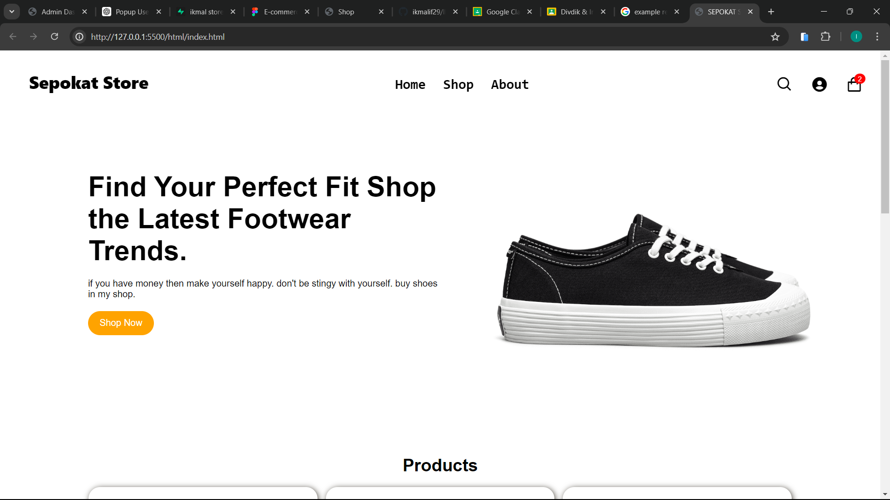
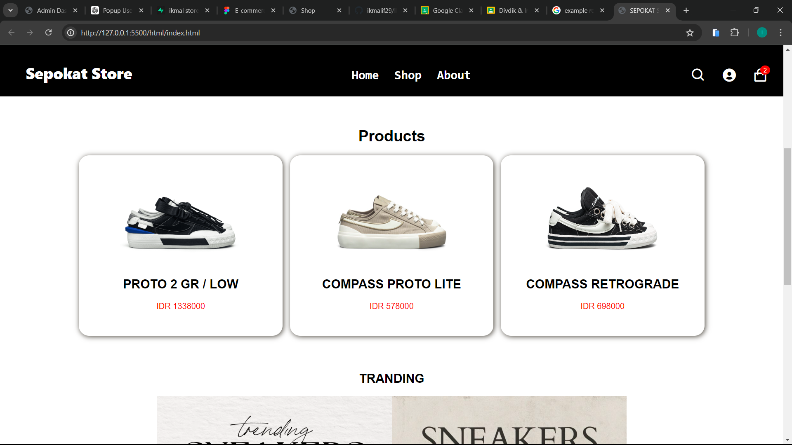

# Sepokat Store

Sepokat Store is an online shoe store designed to offer an elegant and interactive shopping experience. The website is built using HTML, CSS, and JavaScript to provide a responsive and user-friendly interface.

## Features

- **Homepage**: Showcases featured products and promotions.
- **Product Page**: Detailed product information and options to add items to the cart.
- **Cart Page**: View selected products, adjust quantities, and proceed to checkout.
- **Checkout Page**: Manage shipping addresses and payment options.
- **Profile Page**: Update profile information, view purchase history, and log out.
- **Admin Dashboard**: View statistics, manage products, and check order statuses.

## Technologies Used

- **HTML**: For structuring the content.
- **CSS**: For styling the website and making it visually appealing.
- **JavaScript**: For interactive features and dynamic content.

## Pages

### 1. Homepage




The homepage displays featured products and various promotions. Users can navigate to different sections and view the latest offers.

### 2. Product Page


The product page provides detailed information about each product, including images, descriptions, and prices. Users can add products to their cart from this page.

### 3. Cart Page


On the cart page, users can review their selected products, adjust quantities, and proceed to checkout.

### 4. Checkout Page


The checkout page allows users to enter shipping addresses, select payment methods, and complete their orders.

### 5. Profile Page


The profile page enables users to update their personal information, view their purchase history, and log out.

### 6. Admin Dashboard


The admin dashboard provides an overview of total users, products, and orders. It also includes charts and statistics for better management and analysis.

## Getting Started

1. **Clone the Repository**:
   ```bash
   git clone https://github.com/yourusername/sepokat-store.git
cd sepokat-store

### Explanation:

1. **Introduction**: Brief overview of the Sepokat Store website.
2. **Features**: List of main features available on the website.
3. **Technologies Used**: Technologies utilized in the website development.
4. **Pages**: Description and screenshots of each page.
5. **Getting Started**: Instructions to clone the repository and run the project.
6. **Contributing**: Information on how to contribute to the project.
7. **License**: Licensing information.
8. **Contact**: Contact details for inquiries.

### Notes:

- Replace `images/homepage.png`, `images/product-page.png`, etc., with the actual paths to your screenshot images.
- Update `yourusername` and `your.email@example.com` with your actual GitHub username and email address.
